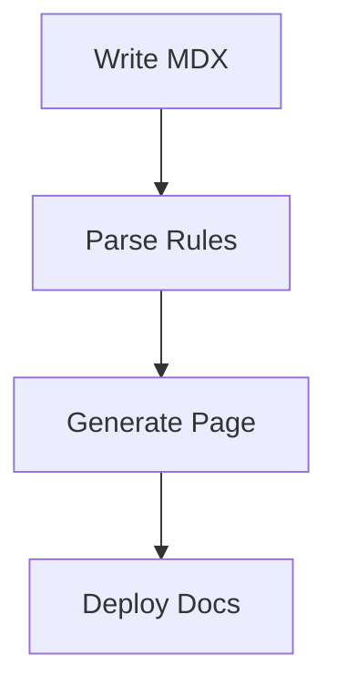

## Recent Updates

Stay informed about the latest releases. Jayesh Chaudhari continuously improves its documentation capabilities with new features, performance enhancements, and bug fixes.

<Update label="2024-10-15" description="v1.2.0" tags={["feature", "improvement", "bugfix"]}>

## New Features

- Added support for custom brand colors in MDX themes, enabling you to match your product's visual identity like `#3B82F6`.
- Introduced real-time preview for MDX editing, so you see changes instantly without rebuilding.

## Improvements

- Enhanced MDX parsing speed by 40%, handling complex components faster.
- Updated component library with new icons from Lucide for better visual consistency.

## Bug Fixes

- Fixed parsing errors with nested code blocks in JSX components.
- Resolved issues with special character escaping in prose, ensuring `{API_KEY}` renders correctly.

</Update>

<Update label="2024-09-20" description="v1.1.0" tags={["feature", "bugfix"]}>

## New Features

- Launched ExpandableGroup component for collapsible FAQs and advanced sections.
- Added Video and Iframe components for embedding tutorials directly in docs.

## Bug Fixes

- Corrected heading hierarchy enforcement, preventing H1 usage in page bodies.
- Patched Mermaid diagram rendering to use only code block syntax, avoiding `<Mermaid>` component errors.

<CodeGroup tabs="JavaScript,Python">
```javascript
// Example migration for new expandable syntax
<Expandable title="Advanced Config" default-open="false">
  Set your `{API_KEY}` here.
</Expandable>
```
```python
# Python docs now support embedded videos
# <Video src="https://example.com/demo.mp4" />
```
</CodeGroup>

</Update>

<Update label="2024-08-10" description="v1.0.0" tags={["feature", "breaking"]}>

## New Features

- Core MDX Writer Agent with strict parsing rules for error-free documentation.
- Integrated 15+ components including Steps, Tabs, and ParamField for rich pages.

## Breaking Changes

- Removed legacy `<Mermaid>` component; use fenced code blocks instead.



</Update>

<Callout kind="tip">
Subscribe to updates via the dashboard at `https://dashboard.example.com/notifications` to get email alerts for new releases.
</Callout>

## How to Stay Updated

Follow these steps to ensure you never miss a release.

<Steps>
  <Step title="Bookmark Changelog" icon="bookmark">
    Pin this page in your browser or docs navigation.
  </Step>
  <Step title="Enable Notifications" icon="bell">
    Visit your account settings and toggle changelog emails.
  </Step>
  <Step title="Check Tags" icon="tag">
    Filter by `feature`, `bugfix`, or `breaking` using the tags on each update.
  </Step>
</Steps>

## Upcoming Changes

Watch for these enhancements in future releases.

<Columns cols={2}>
  <Card title="v1.3.0 (Q4 2024)" icon="zap" href="/changelog#upcoming">
    AI-powered component suggestions and auto-escaping for special characters.
  </Card>
  <Card title="v1.4.0 (Q1 2025)" icon="rocket" href="/changelog#upcoming">
    Full webhook support for automated doc deployments.
  </Card>
</Columns>

<Tabs>
  <Tab title="Breaking Changes" icon="alert-triangle">
    Review migration guides for deprecated components in v1.2.0+.
  </Tab>
  <Tab title="Feature Requests" icon="sparkles">
    Submit ideas via the feedback form at `https://dashboard.example.com/feedback`.
  </Tab>
</Tabs>